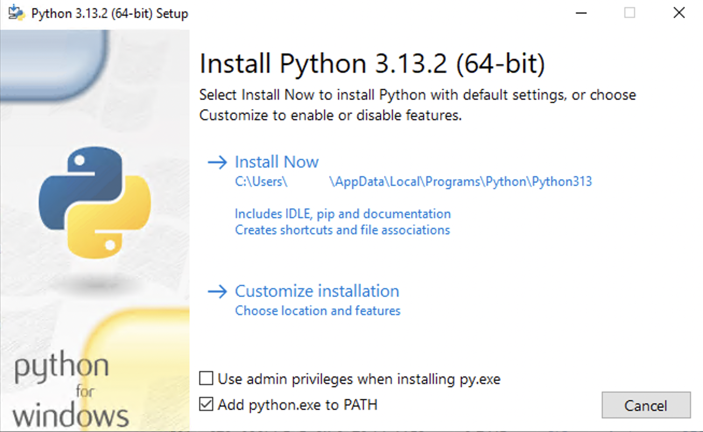
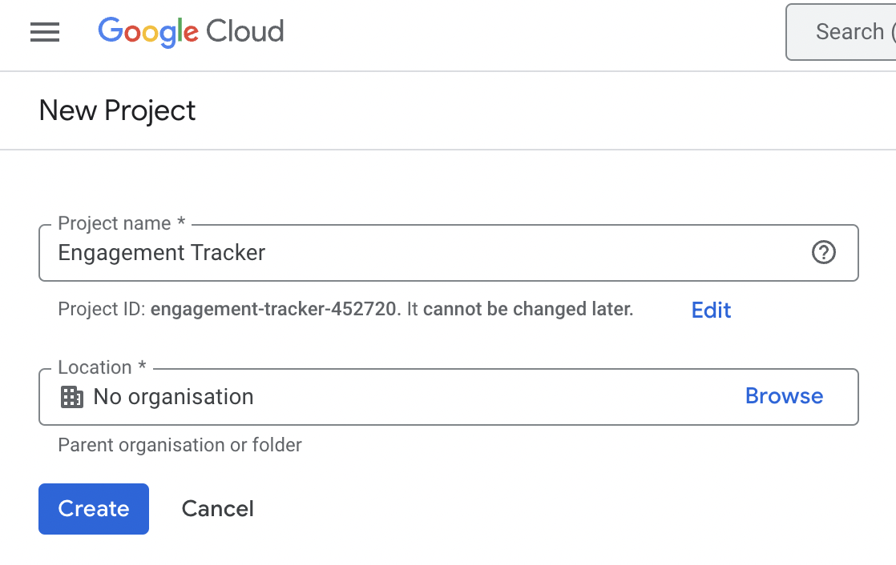
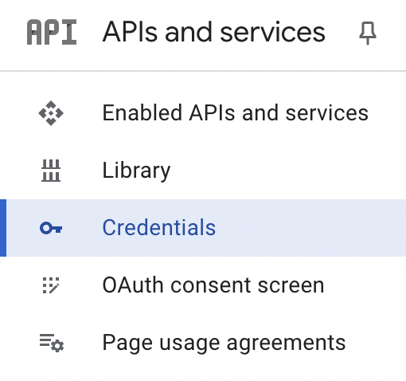
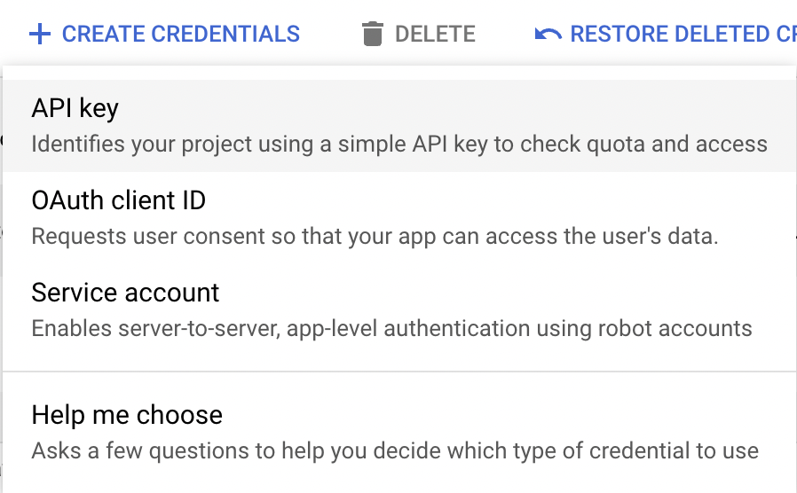
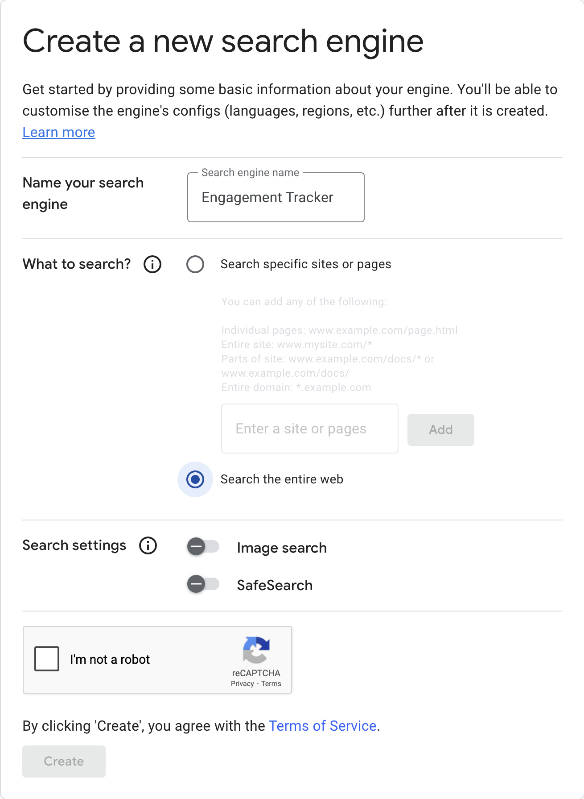
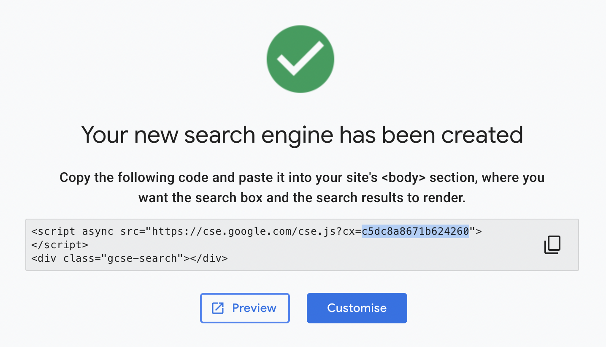

# Engagement Tracker

## Dependencies

1. Install Ollama from [https://ollama.com/download/windows](https://ollama.com/download/windows).
2. Install the latest version of Python 3.13
   from [https://www.python.org/downloads/](https://www.python.org/downloads/).
    1. Select "Add python.exe to PATH".

       
    2. You may need to restart your device for this to take effect.
3. Install the latest version of Node.js from [https://nodejs.org/en/download](https://nodejs.org/en/download).

## Setting up a Google Cloud project

1. Create a Google account at [https://accounts.google.com/](https://accounts.google.com/).
2. Go
   to [https://console.cloud.google.com/](https://console.cloud.google.com/projectselector2/home/dashboard?inv=1&invt=AbrKPg&supportedpurview=project),
   click "Create project" enter a project name and click "Create".

   
3. Click "Go to APIs overview".

   
4. Click "Credentials".

   
5. Click "CREATE CREDENTIALS", select "API key", and note down your key.

   
6. Go to [https://cse.google.com/all](https://cse.google.com/all), click "Add", and create a new search engine. Make
   sure to select "Search the entire web".

   
7. Copy the custom search engine ID from the code snippet where `cx=your_cse_id` and note it down.

   

## Setting up the app

1. Clone the app repository
   from [https://github.com/COMP2281/software-engineering-group24-25-09](https://github.com/COMP2281/software-engineering-group24-25-09).
2. Enter the app directory and run `setup.bat`.
    1. You will be prompted to enter your Google API credentials.

## Running the app

To start the app, run `start.bat`.
