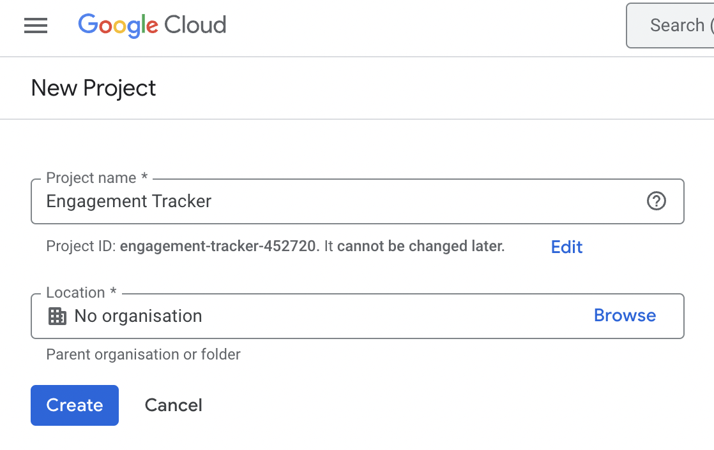
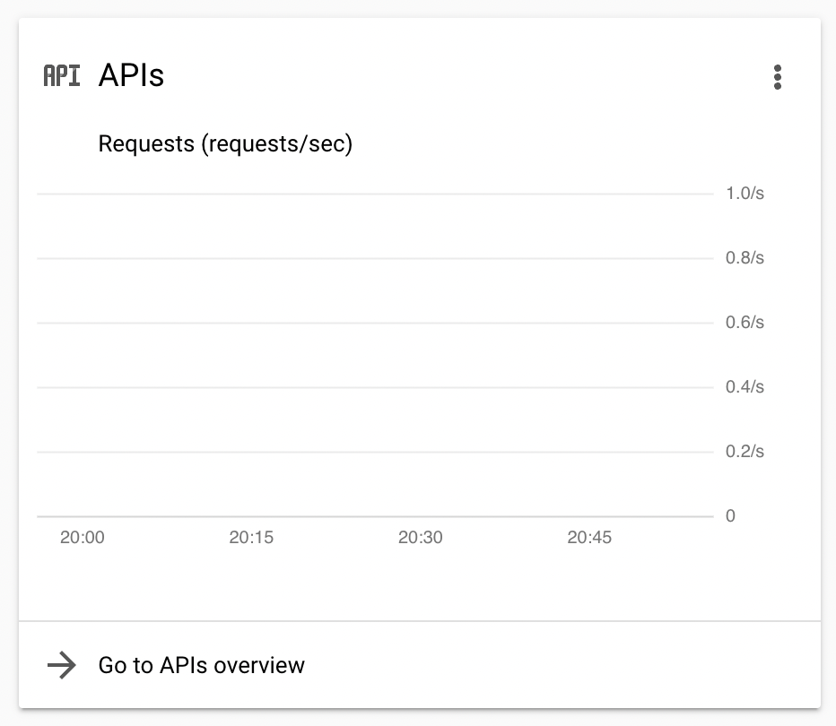
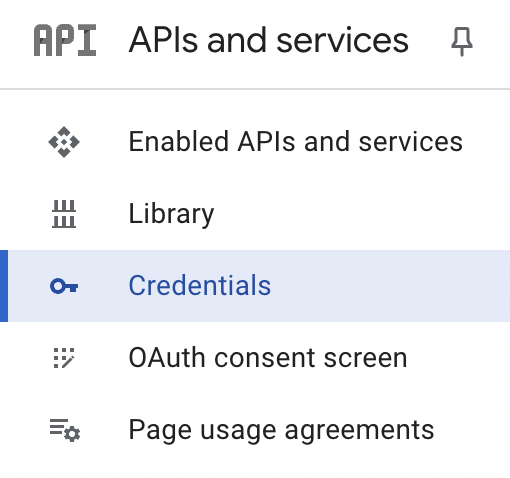
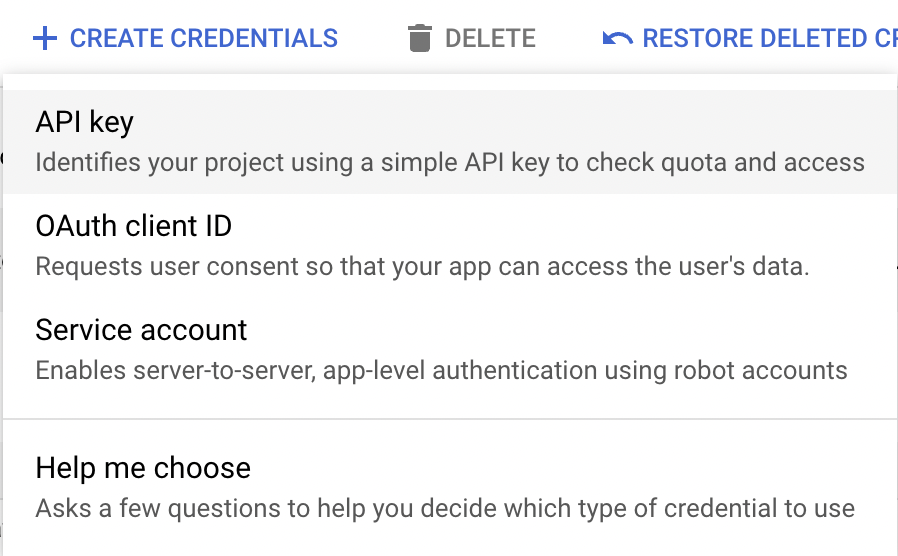
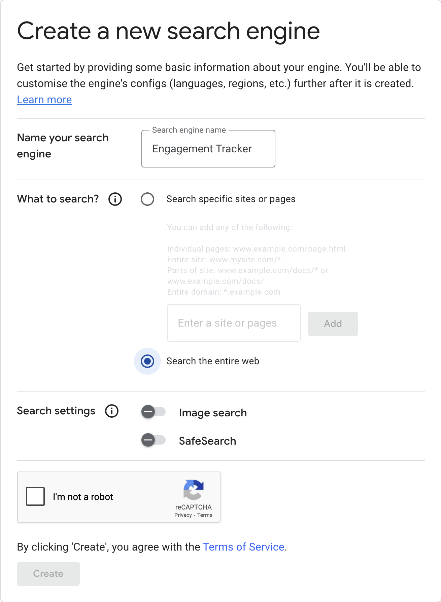
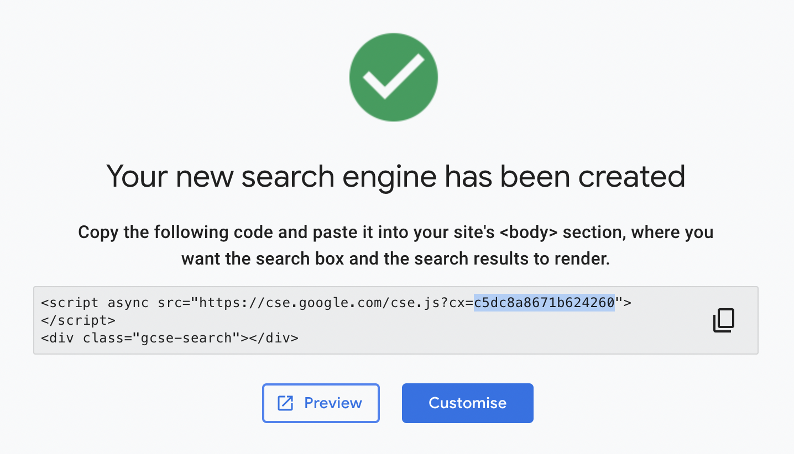

# Engagement Tracker

## Ollama

1. Download and install Ollama from [https://ollama.com/download/windows](https://ollama.com/download/windows)  
2. Open Windows Command Prompt  
3. Run `ollama pull llama3.1:8b` to install the large language model

## Google Cloud Project

1. Create a Google account at [https://accounts.google.com/](https://accounts.google.com/)  
2. Go to [https://console.cloud.google.com/](https://console.cloud.google.com/projectselector2/home/dashboard?inv=1&invt=AbrKPg&supportedpurview=project), click “Create project” enter a project name and click “Create”  
   
3. Click “Go to APIs overview”  
   
4. Click “Credentials”  
   
5. Click “CREATE CREDENTIALS”, select “API key”, and note down your key  
   
6. Go to [https://cse.google.com/all](https://cse.google.com/all), click “Add”, and create a new search engine. Make sure to select “Search the entire web”.  
   
7. Copy the custom search engine ID from the code snippet where `cx=your_cse_id` and note it down.  
   

## Python

1. Download and install the latest version of Python 3.13 from [https://www.python.org/downloads/](https://www.python.org/downloads/)

## Node.js

1. Download and install the latest version of Node.js from [https://nodejs.org/en/download](https://nodejs.org/en/download)

## App Setup

1. Clone the app from [https://github.com/COMP2281/software-engineering-group24-25-09](https://github.com/COMP2281/software-engineering-group24-25-09)  
2. Open Windows Command Prompt and enter the app directory using `cd`  
3. Create a Python 3.13 virtual environment  
   1. Use Pycharm or Visual Studio Code  
   2. Or run `python3.13 -m venv .venv` where `python3.13` is the path to your Python 3.13 installation and run `.venv\Scripts\activate`  
4. Install Python packages by running `pip install -r requirements.txt` in the virtual environment  
5. Run `npm install --prefix frontend`  
6. Create a copy of “example.env” named “.env” and enter your Google Cloud API credentials

## App Start

To start the app, in the virtual environment, run `python server.py`
